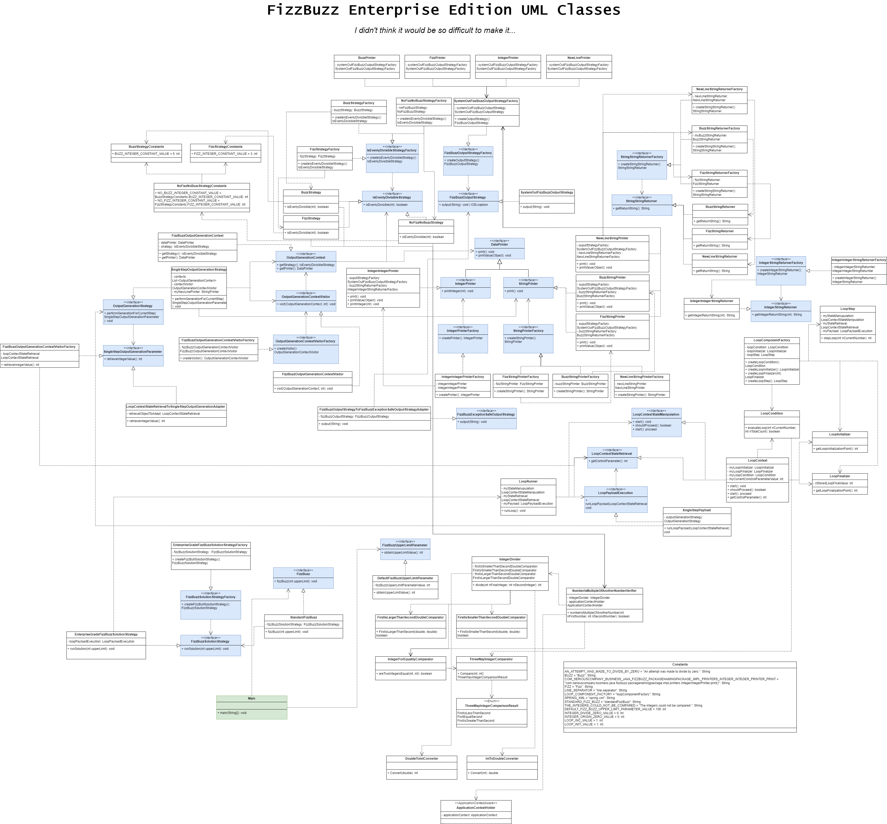

# UML Classes for FizzBuzzEnterpriseEdition

So, there are UML classes diagram for FizzBuzzEnterpriseEdition.

First will be only interfaces and there are all classes on the second diagram below.

I didn't really think about there are SO MANY classes and interfaces. I've spent a lot of time making these diagrams...

So, IT IS **enterprise edition** INDEED

*However, I felt like not to add all of relation arrows into diagram because I was really confused about all these relationships and connections*

## Interfaces

## Classes

Please, don't cry =_(

You can download drawio file or watch image in full resolution in this repository.

Something can be missed in these diagrams, because I am really tired of making it at this moment.
